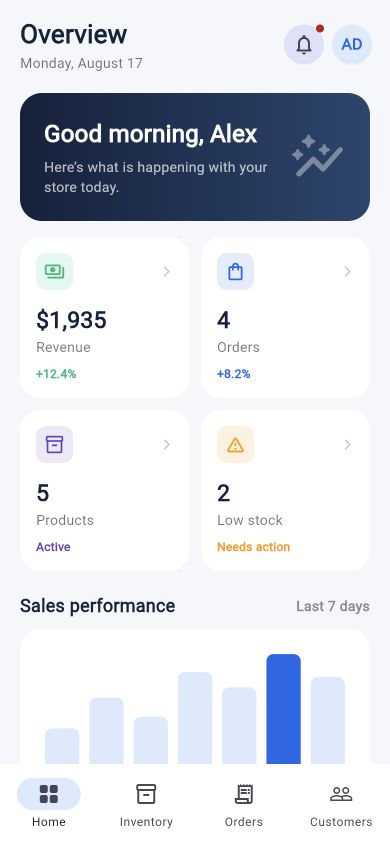
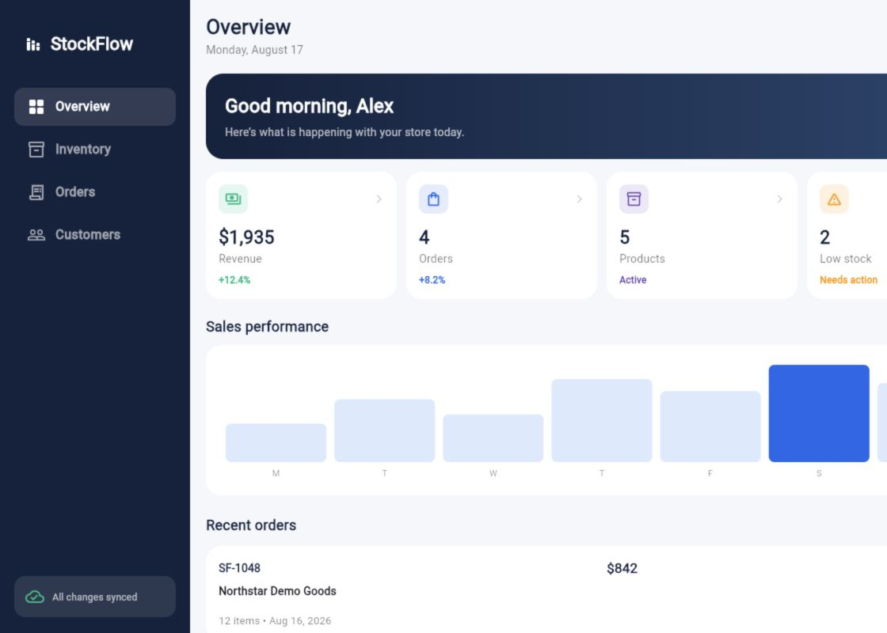

# StockFlow — Flutter Inventory & Order Management Demo

StockFlow is a portfolio-ready Flutter application that shows how a small retail team can monitor sales, manage inventory, review orders, and track customers from one responsive interface.

The demo runs immediately with fictional local data—no account, API key, or Firebase project is required.

<p align="center">
  
</p>

<p align="center">
  
</p>

## What this project demonstrates

- Responsive Material 3 UI for phone, tablet, desktop, and web
- Actionable dashboard KPIs with revenue, order, inventory, and low-stock drill-downs
- Inventory search, low-stock filtering, product details, validation, add, edit, and delete workflows
- Reusable responsive order cards, status chips, order details, and customer order-history navigation
- Lightweight notifications and a fictional demo-account profile
- Loading, empty, error, synchronization, and offline-ready states
- Offline inventory persistence with `SharedPreferences`
- Repository-driven architecture that separates UI, domain models, and data access
- Production integration seams for Firebase Auth, Cloud Firestore, FCM, and a REST exchange-rate service
- Controller, widget, and golden screenshot tests

## Product tour

| Dashboard | Inventory | Operations |
| --- | --- | --- |
| Revenue, order, product, and stock metrics | Search, filter, add, and remove products | Review customer and order activity |
| Adaptive sales overview | Local persistence across restarts | Clear status and feedback states |

## Architecture

```text
Presentation (screens + responsive shell)
                    ↓
State (StoreController + Provider)
                    ↓
Domain (Product, Customer, SalesOrder)
                    ↓
Repository contract (StoreRepository)
          ↙                         ↘
Local demo repository        Production gateways
(SharedPreferences)          (Firebase / REST / FCM)
```

The portfolio build intentionally uses `LocalDemoRepository`, keeping the reviewer experience fast and credential-free. The interfaces in `lib/data/` provide clear extension points for a production backend.

## Tech stack

- Flutter and Dart
- Material 3
- Provider
- SharedPreferences
- Firebase Auth, Cloud Firestore, and Firebase Cloud Messaging integration seams
- HTTP REST client
- Flutter test and golden image testing

## Run locally

### Requirements

- Flutter SDK compatible with Dart `^3.13.0`
- A configured Android emulator, iOS simulator, Chrome, or physical device

### Start the demo

```bash
git clone https://github.com/YOUR_USERNAME/stockflow-flutter-demo.git
cd stockflow-flutter-demo
flutter pub get
flutter run
```

Choose a specific target when needed:

```bash
flutter run -d chrome
flutter run -d android
flutter run -d ios
```

## Quality checks

```bash
flutter analyze
flutter test
flutter build web --release
flutter build apk --debug
```

GitHub Actions runs static analysis and tests for every push and pull request. The committed golden tests protect both mobile and desktop dashboard presentation.

## Optional Firebase connection

Firebase is not required for the public demo. To connect your own project:

1. Create a Firebase project and register the target apps.
2. Run `flutterfire configure` to generate local Firebase configuration.
3. Initialize Firebase before `runApp`.
4. Implement or connect a Firestore-backed `StoreRepository`.
5. Enable the required Auth, Firestore, and Messaging services and deploy least-privilege security rules.

Firebase configuration, signing material, environment files, and private keys are excluded from version control. Never commit production credentials.

## Portfolio-safe data policy

This repository is a standalone portfolio demonstration and is not connected to any client system or production database. All names, businesses, orders, SKUs, metrics, and `.example` email addresses are fictional. No private client data, personal contact information, Firebase project configuration, signing keys, or secrets are included.

## Portfolio screenshots

The final images in `outputs/screenshots/` are captured from the real compiled web application:

- Mobile dashboard
- Mobile inventory
- Mobile orders with responsive status chips
- Mobile customer details and recent-order history
- Mobile order details
- Mobile notifications
- Desktop responsive dashboard

## 45–60 second demo-video shot list

1. **0–5s — Overview:** introduce the polished responsive dashboard.
2. **5–12s — Low stock:** tap the Low Stock metric and show the pre-filtered inventory.
3. **12–20s — Product workflow:** search for a product, open Product Details, and briefly show Edit.
4. **20–28s — Orders:** open Orders and select an order to show its complete status and details.
5. **28–38s — Customers:** open a customer, explain total versus recent orders, and drill into an order.
6. **38–45s — Notifications:** show the fictional low-stock, dispatch, and synchronization alerts.
7. **45–50s — Profile:** open the AD avatar and show the credential-free demo account.
8. **50–60s — Finish:** return to Overview and briefly show the adaptive desktop layout.

Record only the application. Do not show terminals, source code, private tabs, credentials, configuration files, or personal information.

## Project status

- Portfolio demo: complete
- Local/offline workflow: implemented
- Firebase/REST/FCM: integration seams included; deployment credentials intentionally omitted
- Automated checks: analysis, controller/widget interaction tests, responsive overflow coverage, and golden tests

## Client summary

StockFlow demonstrates a clean, maintainable Flutter delivery: responsive UI, useful business workflows, offline behavior, test coverage, and a practical path from a self-contained demo to production services.
